# MCP Call Connect

A comprehensive WebRTC-based call center solution featuring real-time audio calls, intelligent AI-powered transcription with speaker diarization, LLM-driven call analysis, and a modern multi-portal dashboard. This project integrates a robust Node.js backend, a high-performance Next.js 16 frontend, and a Python-based AI transcription service.

---

## Table of Contents

- [Key Features](#key-features)
- [Screenshots](#screenshots)
- [System Architecture](#system-architecture)
- [Tech Stack](#tech-stack)
- [Prerequisites](#prerequisites)
- [Installation & Setup](#installation--setup)
- [Running the Application](#running-the-application)
- [Environment Variables](#environment-variables)
- [API Documentation](#api-documentation)
- [Socket.IO Events](#socketio-events)
- [Database Models](#database-models)
- [Project Structure](#project-structure)
- [Data Flow](#data-flow)
- [Security](#security)
- [Contributing](#contributing)
- [License](#license)

---

## Key Features

### Real-time Communication
- **WebRTC Audio Calls**: Low-latency peer-to-peer audio communication between agents and customers
- **Live Agent Status**: Real-time status updates (Online/Busy/Offline) via Socket.IO
- **Instant Call Notifications**: Agents receive incoming call alerts in real-time

### AI-Powered Intelligence
- **Automatic Transcription**: Speech-to-text using OpenAI Whisper
- **Speaker Diarization**: Automatic identification and labeling of Agent vs. Customer using Pyannote
- **LLM Call Analysis** (GPT-4): Comprehensive analysis including:
  - Sentiment analysis (customer, agent, timeline)
  - Topic and category extraction
  - Action items identification
  - Agent performance scoring (6 dimensions)
  - Customer experience metrics
  - Compliance checking
  - Risk flagging (churn, escalation, legal, VIP)
  - Structured recommendations

### Call Management
- **Automatic Recording**: Server-side recording of all calls in WebM format
- **Call History**: Detailed logs with searchable, filterable interface
- **Downloadable Assets**: Access to recordings and transcripts

### Multi-Portal Architecture
- **Agent Portal**: Dashboard, call history, analytics, performance metrics, settings
- **Customer Portal**: Registration, make calls, call history
- **SuperAdmin Portal**: Agent management, dashboard KPIs, analytics, agent comparison

### Security
- **JWT Authentication**: Secure token-based authentication with 7-day expiry
- **Bcrypt Password Hashing**: Industry-standard password security
- **Role-based Access Control**: Separate authentication for agents and superadmins
- **Protected Routes**: Middleware-enforced access control

---

## Screenshots

### Agent Portal
| Dashboard | Call Stats | Analytics | Performance |
| :---: | :---: | :---: | :---: |
| 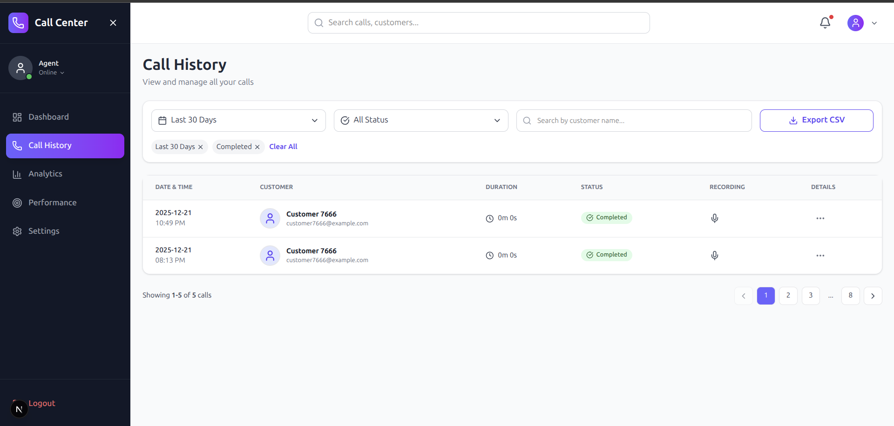 | 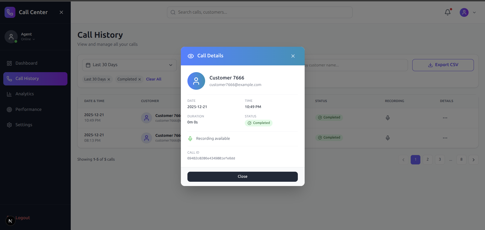 | 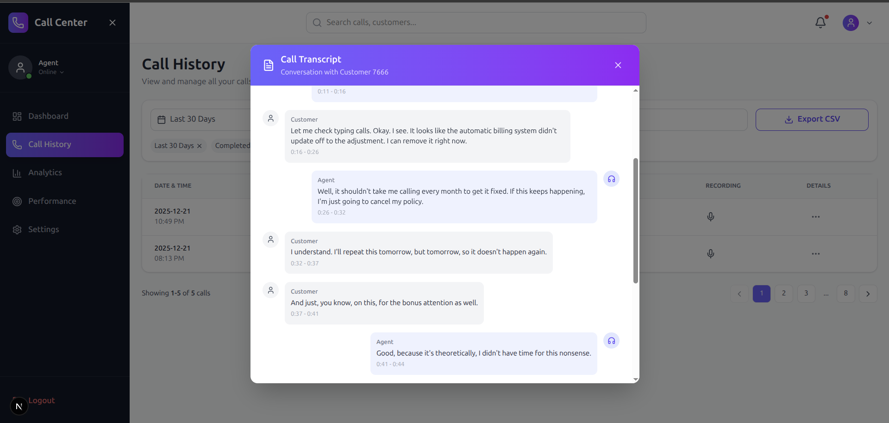 | 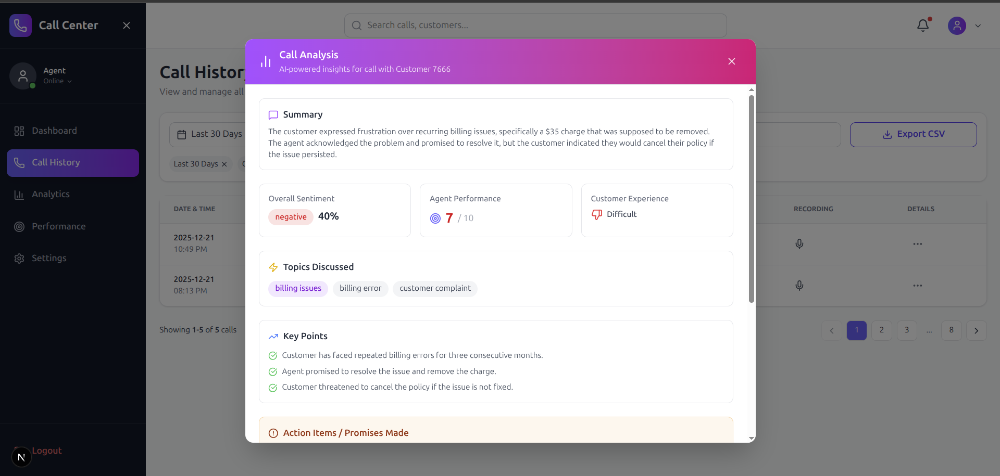 |
| 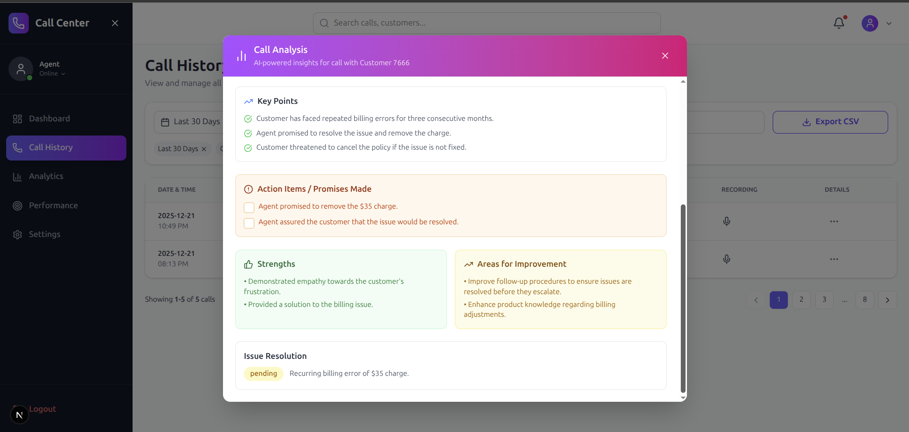 | 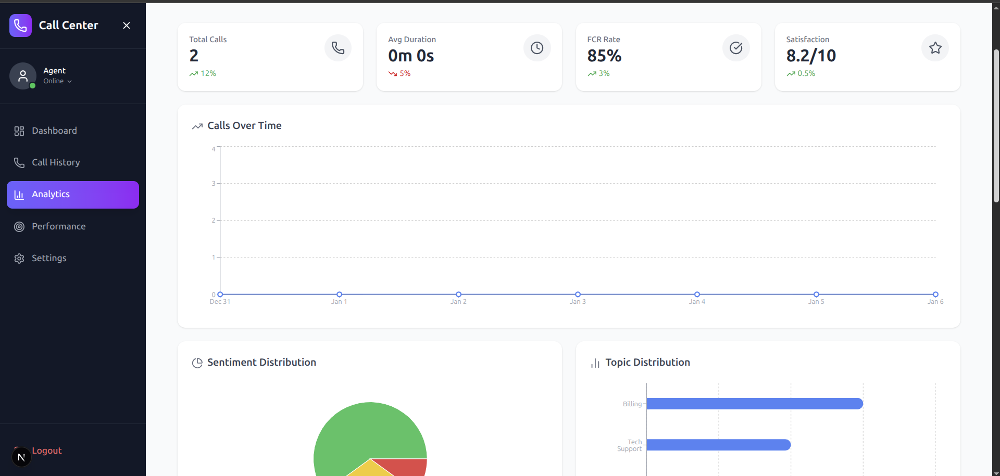 | 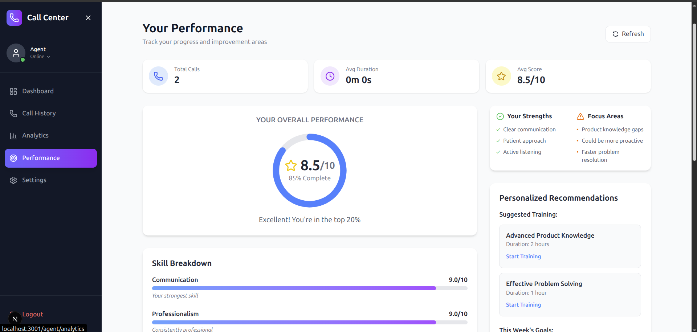 | 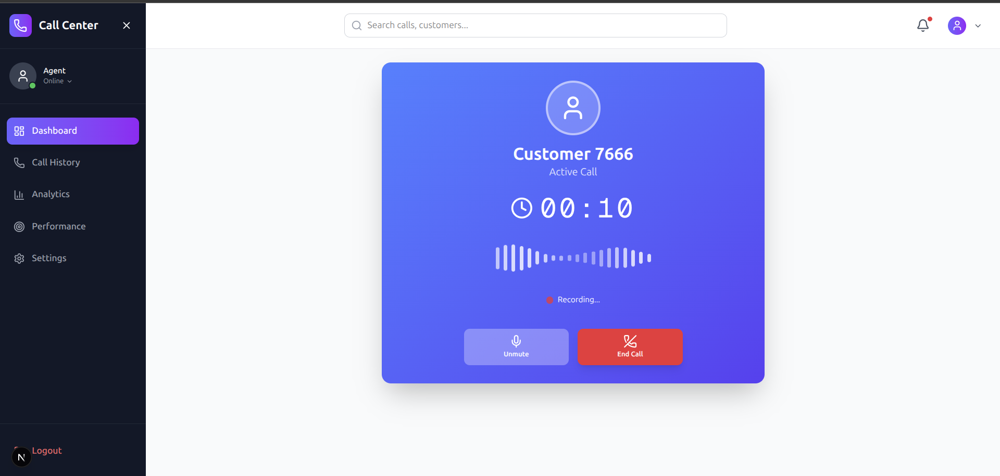 |

### Customer Portal
| Registration | Live Call Interface |
| :---: | :---: |
| 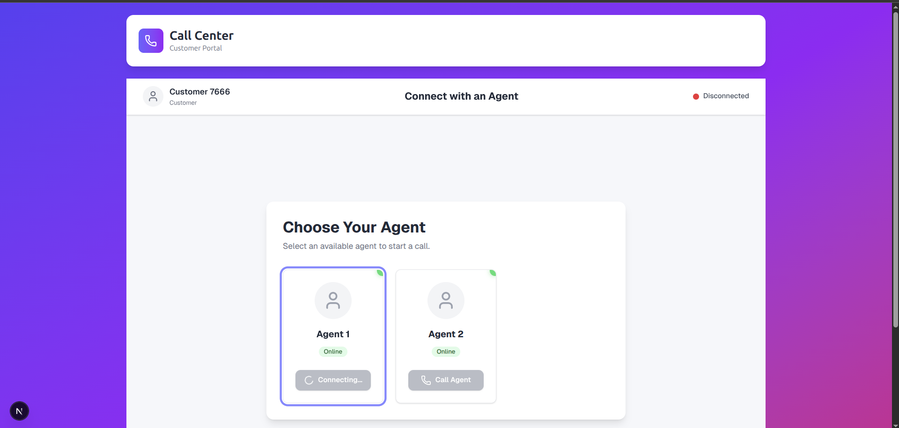 | 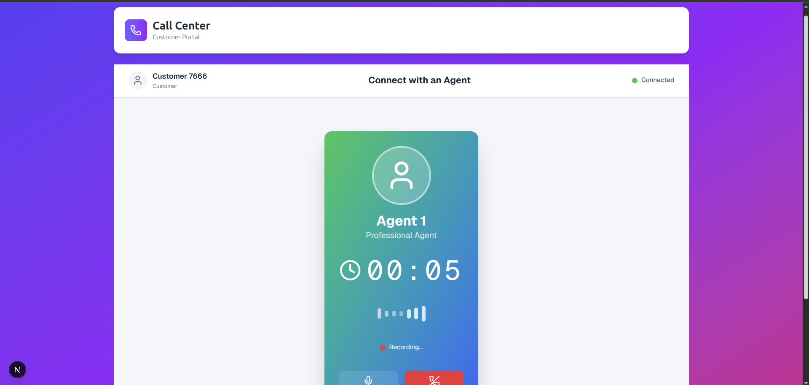 |

### SuperAdmin & Analytics
| Admin Dashboard | Agent Management | Call Analysis Insights |
| :---: | :---: | :---: |
|  | 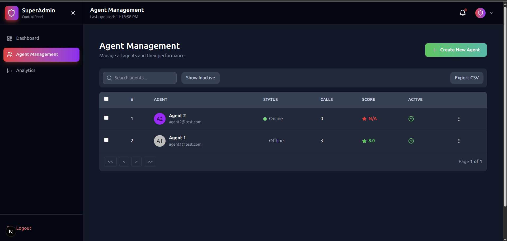 | 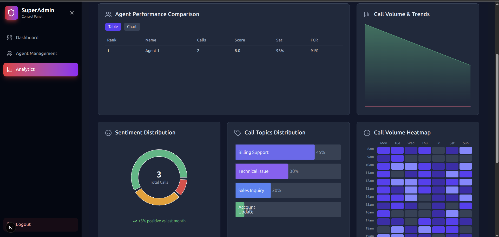 |

---

## System Architecture

```
┌─────────────────────────────────────────────────────────────────────────────┐
│                              FRONTEND (Next.js 16)                          │
│  ┌─────────────┐    ┌─────────────┐    ┌─────────────────────┐              │
│  │Agent Portal │    │Customer     │    │SuperAdmin Portal    │              │
│  │- Dashboard  │    │Portal       │    │- Agent Management   │              │
│  │- Calls      │    │- Call Page  │    │- Dashboard KPIs     │              │
│  │- Analytics  │    │- History    │    │- Analytics          │              │
│  └──────┬──────┘    └──────┬──────┘    └──────────┬──────────┘              │
└─────────┼──────────────────┼──────────────────────┼─────────────────────────┘
          │                  │                      │
          │    REST API + Socket.IO (WebRTC Signaling)
          ▼                  ▼                     ▼
┌─────────────────────────────────────────────────────────────────────────────┐
│                         BACKEND (Node.js/Express)                           │
│  ┌─────────────────┐  ┌─────────────────┐  ┌─────────────────┐              │
│  │Signaling Service│  │Recording Service│  │Auth Middleware  │              │
│  │(Socket.IO)      │  │(WebM storage)   │  │(JWT validation) │              │
│  └────────┬────────┘  └────────┬────────┘  └─────────────────┘              │
│           │                    │                                            │
│  ┌────────▼────────────────────▼────────┐   ┌─────────────────┐             │
│  │         Transcription Service        │   │LLM Analysis     │             │
│  │    (Calls Python API on completion)  │──▶│Service (GPT-4)  │             │
│  └────────┬─────────────────────────────┘   └────────┬────────┘             │
│           │                                          │                      │
│           │              MongoDB                     │                      │
│           └──────────────────┬───────────────────────┘                      │
└──────────────────────────────┼──────────────────────────────────────────────┘
                               │
          ┌────────────────────┼────────────────────┐
          ▼                    ▼                    ▼
┌─────────────────┐  ┌─────────────────┐  ┌─────────────────┐
│   Agent Model   │  │   Call Model    │  │ CallAnalysis    │
│   Customer      │  │   (recordings,  │  │ Model           │
│   SuperAdmin    │  │   transcripts)  │  │ (AI insights)   │
└─────────────────┘  └─────────────────┘  └─────────────────┘

┌─────────────────────────────────────────────────────────────────────────────┐
│                      PYTHON AI SERVICE (FastAPI)                            │
│  ┌─────────────────┐  ┌─────────────────┐  ┌─────────────────┐              │
│  │  Whisper Model  │  │  Pyannote Model │  │  Audio Utils    │              │
│  │  (Transcription)│  │  (Diarization)  │  │  (WAV convert)  │              │
│  └─────────────────┘  └─────────────────┘  └─────────────────┘              │
└─────────────────────────────────────────────────────────────────────────────┘
```

---

## Tech Stack

### Frontend
| Technology | Version | Purpose |
|------------|---------|---------|
| Next.js | 16.0.5 | React framework with App Router |
| React | 19.2.0 | UI library |
| TypeScript | 5.x | Type safety |
| Tailwind CSS | 4.x | Styling |
| Radix UI | Latest | Accessible headless components |
| Socket.IO Client | 4.8.1 | Real-time communication |
| Recharts | 3.5.1 | Data visualization |
| React Hook Form | 7.67.0 | Form management |
| Lucide React | 0.555.0 | Icons |
| Zod | 4.1.13 | Schema validation |

### Backend
| Technology | Version | Purpose |
|------------|---------|---------|
| Node.js | 18+ | Runtime environment |
| Express.js | 4.18.2 | Web framework |
| Socket.IO | 4.6.1 | Real-time WebSocket communication |
| Mongoose | 8.0.3 | MongoDB ODM |
| JWT | 9.0.2 | Authentication tokens |
| Bcrypt.js | 2.4.3 | Password hashing |
| OpenAI SDK | 6.9.0 | LLM integration |
| Axios | 1.13.2 | HTTP client |
| Fluent-ffmpeg | 2.1.2 | Audio processing |

### Python AI Service
| Technology | Purpose |
|------------|---------|
| FastAPI | High-performance async web framework |
| Uvicorn | ASGI server |
| Whisper / faster-whisper | Speech-to-text transcription |
| Pyannote.audio | Speaker diarization |
| PyTorch | ML model runtime |
| Pydantic | Data validation |

### Database
| Technology | Purpose |
|------------|---------|
| MongoDB | Document database |

---

## Prerequisites

Ensure you have the following installed before running the project:

| Requirement | Version | Notes |
|-------------|---------|-------|
| Node.js | 18+ | JavaScript runtime |
| Python | 3.10+ | For AI transcription service |
| MongoDB | 6.0+ | Local instance or cloud (MongoDB Atlas) |
| FFmpeg | Latest | Required for audio format conversion |
| CUDA (Optional) | 11.x+ | GPU acceleration for ML models |

### External API Keys Required
- **OpenAI API Key**: For GPT-4 call analysis
- **Hugging Face Token**: For Pyannote speaker diarization (requires accepting model agreement)

---

## Installation & Setup

### 1. Clone the Repository

```bash
git clone https://github.com/your-username/MCP_Call_Connect.git
cd MCP_Call_Connect
```

### 2. Backend Setup (`webrtc-call-server`)

```bash
cd webrtc-call-server
npm install
```

Create `.env` file:
```env
PORT=3000
MONGODB_URI=mongodb://localhost:27017/webrtc_call_db
JWT_SECRET=your_super_secret_jwt_key_change_this_in_production
RECORDING_PATH=./recordings
NODE_ENV=development
TRANSCRIPTION_API_URL=http://localhost:8000
OPENAI_API_KEY=sk-proj-your-openai-api-key
LLM_MODEL=gpt-4o-mini
CLIENT_ORIGINS=http://localhost:3001
```

### 3. Python Transcriber Service Setup (`transcriber`)

```bash
cd transcriber
python -m venv venv
source venv/bin/activate  # On Windows: venv\Scripts\activate
pip install fastapi uvicorn python-dotenv pydantic
pip install openai-whisper  # or: pip install faster-whisper
pip install pyannote.audio
pip install torch torchaudio
```

Create `.env` file:
```env
HF_TOKEN=hf_your_huggingface_token_here
```

> **Note**: You must accept the Pyannote speaker diarization model agreement on Hugging Face to obtain a valid token.

### 4. Frontend Setup (`frontend/my-app`)

```bash
cd frontend/my-app
npm install
```

Create `.env.local` file:
```env
NEXT_PUBLIC_API_BASE_URL=http://localhost:3000
```

---

## Running the Application

Start all three services in separate terminal windows:

### Terminal 1: MongoDB (if running locally)
```bash
mongod --dbpath /path/to/data/db
```

### Terminal 2: Backend Server
```bash
cd webrtc-call-server
npm start
# Server runs on http://localhost:3000
```

### Terminal 3: Python Transcriber Service
```bash
cd transcriber
source venv/bin/activate  # On Windows: venv\Scripts\activate
uvicorn transcriber_api:app --reload --host 0.0.0.0 --port 8000
# API runs on http://localhost:8000
```

### Terminal 4: Frontend Application
```bash
cd frontend/my-app
npm run dev
# App runs on http://localhost:3001 (auto-selects if 3000 is taken)
```

### Access Points
| Service | URL |
|---------|-----|
| Agent Portal | http://localhost:3001/agent/login |
| Customer Portal | http://localhost:3001/customer/register |
| SuperAdmin Portal | http://localhost:3001/superadmin/login |
| Backend Health Check | http://localhost:3000/health |
| Transcriber Health Check | http://localhost:8000/health |

---

## Environment Variables

### Backend (`webrtc-call-server/.env`)

| Variable | Required | Description |
|----------|----------|-------------|
| `PORT` | Yes | Server port (default: 3000) |
| `MONGODB_URI` | Yes | MongoDB connection string |
| `JWT_SECRET` | Yes | Secret key for JWT signing |
| `RECORDING_PATH` | Yes | Directory for audio recordings |
| `NODE_ENV` | No | Environment (development/production) |
| `TRANSCRIPTION_API_URL` | Yes | Python transcriber service URL |
| `OPENAI_API_KEY` | Yes | OpenAI API key for GPT-4 analysis |
| `LLM_MODEL` | No | OpenAI model (default: gpt-4o-mini) |
| `CLIENT_ORIGINS` | Yes | Allowed CORS origins |

### Python Service (`transcriber/.env`)

| Variable | Required | Description |
|----------|----------|-------------|
| `HF_TOKEN` | Yes | Hugging Face API token for Pyannote |

### Frontend (`frontend/my-app/.env.local`)

| Variable | Required | Description |
|----------|----------|-------------|
| `NEXT_PUBLIC_API_BASE_URL` | Yes | Backend API URL |

---

## API Documentation

### Agent Routes (`/api/agents`)

| Method | Endpoint | Auth | Description |
|--------|----------|------|-------------|
| POST | `/register` | No | Register new agent account |
| POST | `/login` | No | Authenticate agent, returns JWT |
| GET | `/profile` | JWT | Get logged-in agent profile |
| GET | `/all` | No | Get all online agents (for customers) |

### Customer Routes (`/api/customers`)

| Method | Endpoint | Auth | Description |
|--------|----------|------|-------------|
| POST | `/register` | No | Auto-register guest customer |
| GET | `/all` | JWT | List all customers |
| GET | `/:id` | JWT | Get customer details |

### Call Routes (`/api/calls`)

| Method | Endpoint | Auth | Description |
|--------|----------|------|-------------|
| GET | `/all` | JWT | Get all calls (paginated) |
| GET | `/my-calls` | JWT | Get agent's call history |
| GET | `/stats` | No | Overall call statistics |
| GET | `/:id` | JWT | Get specific call details |
| GET | `/:id/recording` | JWT | Download recording file |

### Transcription Routes (`/api/transcriptions`)

| Method | Endpoint | Auth | Description |
|--------|----------|------|-------------|
| GET | `/:callId` | No | Get transcript for call |
| POST | `/:callId/transcribe` | No | Manually trigger transcription |
| GET | `/:callId/status` | No | Check transcription status |

### Analysis Routes (`/api/analysis`)

| Method | Endpoint | Auth | Description |
|--------|----------|------|-------------|
| POST | `/:callId/analyze` | JWT | Trigger LLM analysis |
| GET | `/:callId` | JWT | Get analysis results |
| GET | `/` | JWT | List all analyses |
| GET | `/summary/stats` | JWT | Analytics dashboard summary |
| GET | `/agent/:agentId/metrics` | JWT | Agent performance metrics |

### SuperAdmin Routes (`/api/superadmin`)

#### Authentication
| Method | Endpoint | Auth | Description |
|--------|----------|------|-------------|
| POST | `/register` | No | Create admin account |
| POST | `/login` | No | Admin login |
| GET | `/profile` | Admin | Get admin profile |

#### Agent Management
| Method | Endpoint | Auth | Description |
|--------|----------|------|-------------|
| POST | `/agents` | Admin | Create new agent |
| GET | `/agents` | Admin | List all agents |
| GET | `/agents/:id` | Admin | Get agent details |
| PUT | `/agents/:id` | Admin | Update agent info |
| PUT | `/agents/:id/password` | Admin | Reset agent password |
| DELETE | `/agents/:id` | Admin | Soft delete agent |
| POST | `/agents/:id/restore` | Admin | Restore deleted agent |
| DELETE | `/agents/:id/permanent` | Admin | Permanently delete agent |
| PATCH | `/agents/:id/toggle-status` | Admin | Toggle active/inactive |

#### Dashboard
| Method | Endpoint | Auth | Description |
|--------|----------|------|-------------|
| GET | `/dashboard/stats` | Admin | Dashboard KPIs |
| GET | `/dashboard/agent-comparison` | Admin | Agent comparison metrics |

### Python Transcriber API (`/`)

| Method | Endpoint | Description |
|--------|----------|-------------|
| GET | `/` | Service health check |
| GET | `/health` | Detailed health status |
| POST | `/transcribe` | Upload file for transcription |
| POST | `/transcribe-from-path` | Transcribe file by server path |

---

## Socket.IO Events

### Client to Server

| Event | Payload | Description |
|-------|---------|-------------|
| `agent:join` | `{ agentId }` | Agent joins signaling server |
| `customer:join` | `{ customerId }` | Customer joins signaling server |
| `call:initiate` | `{ customerId, agentId }` | Customer initiates call to agent |
| `call:accept` | `{ callId }` | Agent accepts incoming call |
| `call:end` | `{ callId }` | Either party ends call |
| `webrtc:offer` | `{ callId, offer }` | Send WebRTC offer (SDP) |
| `webrtc:answer` | `{ callId, answer }` | Send WebRTC answer (SDP) |
| `webrtc:ice-candidate` | `{ callId, candidate }` | ICE candidate exchange |
| `recording:complete` | `{ callId, blob }` | Upload recording after call |

### Server to Client

| Event | Payload | Description |
|-------|---------|-------------|
| `call:incoming` | `{ callId, customer }` | Notify agent of incoming call |
| `call:initiated` | `{ callId }` | Confirm call ID to customer |
| `call:accepted` | `{ callId, agent }` | Notify customer call accepted |
| `call:ended` | `{ callId, reason }` | Notify both parties call ended |
| `webrtc:offer` | `{ callId, offer }` | Forward offer to recipient |
| `webrtc:answer` | `{ callId, answer }` | Forward answer to recipient |
| `webrtc:ice-candidate` | `{ callId, candidate }` | Forward ICE candidate |
| `agent:status-changed` | `{ agentId, status }` | Agent status update |

---

## Database Models

### Agent
```javascript
{
  name: String,
  email: String (unique),
  password: String (bcrypt hashed),
  status: 'online' | 'busy' | 'offline',
  socketId: String,
  isActive: Boolean,
  totalCalls: Number,
  averageRating: Number,
  createdAt: Date,
  createdBy: ObjectId,
  updatedBy: ObjectId,
  deletedAt: Date,
  deletedBy: ObjectId
}
```

### Customer
```javascript
{
  name: String,
  email: String,
  phone: String,
  socketId: String,
  createdAt: Date
}
```

### Call
```javascript
{
  agent: ObjectId (ref: Agent),
  customer: ObjectId (ref: Customer),
  startTime: Date,
  endTime: Date,
  duration: Number (auto-calculated),
  recordingUrl: String,
  status: 'initiated' | 'ringing' | 'ongoing' | 'completed' | 'missed' | 'failed',
  callId: String (unique),
  transcription: {
    status: 'pending' | 'processing' | 'completed' | 'failed',
    conversation: [{
      speaker: String,
      text: String,
      startTime: Number,
      endTime: Number
    }],
    metadata: {
      duration: Number,
      wordCount: Number,
      processedAt: Date
    }
  }
}
```

### CallAnalysis
```javascript
{
  call: ObjectId (ref: Call),
  summary: { brief, keyPoints[], outcome },
  sentiment: { overall, customer, agent, timeline[], scores },
  topics: { primary, secondary[], categories[] },
  actionItems: { customerTasks[], agentFollowUps[], promisesMade[] },
  issues: { primary, secondary[], rootCause, severity, resolutionStatus },
  agentPerformance: {
    strengths[], improvements[],
    scores: { professionalism, empathy, efficiency, knowledge, communication, problemSolving }
  },
  customerExperience: { satisfactionIndicators, painPoints[], effortScore, transferCount },
  compliance: { greetingQuality, closingQuality, policyAdherence[], violations[] },
  businessInsights: { featureRequests[], productFeedback[], competitorMentions[], bugReports[] },
  recommendations: { forAgent[], forManager[], trainingNeeds[], productImprovements[] },
  riskFlags: { churnRisk, escalationRisk, legalRisk, vipCustomer },
  metadata: { model, processingTime, confidence, tokenUsage },
  analyzedAt: Date
}
```

### SuperAdmin
```javascript
{
  name: String,
  email: String (unique),
  password: String (bcrypt hashed),
  role: 'superadmin' (immutable),
  isActive: Boolean,
  lastLogin: Date,
  createdAt: Date
}
```

---

## Project Structure

```
MCP_Call_Connect/
├── frontend/
│   ├── my-app/                           # Next.js 16 Application
│   │   ├── app/                          # App Router
│   │   │   ├── (agent)/                  # Agent routes group
│   │   │   │   └── agent/
│   │   │   │       ├── (auth)/           # Auth pages (login, register)
│   │   │   │       └── (dashboard)/      # Protected dashboard pages
│   │   │   │           ├── dashboard/
│   │   │   │           ├── calls/
│   │   │   │           ├── analytics/
│   │   │   │           ├── performance/
│   │   │   │           └── settings/
│   │   │   ├── (customer)/               # Customer routes
│   │   │   │   └── customer/
│   │   │   │       ├── register/
│   │   │   │       ├── call/
│   │   │   │       └── history/
│   │   │   ├── (superadmin)/             # SuperAdmin routes
│   │   │   │   └── superadmin/
│   │   │   │       ├── (auth)/
│   │   │   │       └── (dashboard)/
│   │   │   │           ├── dashboard/
│   │   │   │           ├── agents/
│   │   │   │           └── analytics/
│   │   │   ├── page.tsx                  # Home page
│   │   │   └── layout.tsx                # Root layout
│   │   ├── components/
│   │   │   └── ui/                       # Radix UI components
│   │   ├── lib/
│   │   │   ├── api.ts                    # API configuration
│   │   │   ├── socket-context.tsx        # Socket.IO provider
│   │   │   └── utils.ts                  # Utilities
│   │   ├── package.json
│   │   ├── tailwind.config.js
│   │   └── next.config.ts
│   └── FRONTEND-GUIDE.md
│
├── webrtc-call-server/                   # Node.js Backend
│   ├── src/
│   │   ├── controllers/
│   │   │   ├── agent.controller.js
│   │   │   ├── customer.controller.js
│   │   │   ├── call.controller.js
│   │   │   ├── transcription.controller.js
│   │   │   ├── analysis.controller.js
│   │   │   └── superadmin.controller.js
│   │   ├── models/
│   │   │   ├── Agent.js
│   │   │   ├── Customer.js
│   │   │   ├── Call.js
│   │   │   ├── CallAnalysis.js
│   │   │   └── SuperAdmin.js
│   │   ├── routes/
│   │   │   ├── agent.routes.js
│   │   │   ├── customer.routes.js
│   │   │   ├── call.routes.js
│   │   │   ├── transcription.routes.js
│   │   │   ├── analysis.routes.js
│   │   │   └── superadmin.routes.js
│   │   ├── services/
│   │   │   ├── signaling.service.js      # WebRTC signaling
│   │   │   ├── recording.service.js      # Audio recording
│   │   │   ├── transcription.service.js  # Python API integration
│   │   │   └── llm-analysis.service.js   # GPT-4 analysis
│   │   ├── middleware/
│   │   │   ├── auth.middleware.js
│   │   │   └── superadmin.middleware.js
│   │   ├── config/
│   │   │   └── database.js
│   │   └── server.js                     # Entry point
│   ├── recordings/                       # Audio storage
│   ├── package.json
│   ├── API-EXAMPLE.md
│   ├── DEPLOYMENT.md
│   └── README.md
│
├── transcriber/                          # Python AI Service
│   ├── transcriber_api.py                # FastAPI entry point
│   ├── transcriber.py                    # Whisper + Pyannote logic
│   ├── config.py                         # Configuration
│   ├── utils.py                          # Utilities
│   ├── process_recordings.py
│   ├── output/                           # Transcription output
│   └── requirements.txt
│
├── .gitignore
└── README.md                             # This file
```

---

## Data Flow

### Call Flow
```
1. Customer visits /customer/call
   ↓
2. Customer auto-registers (if new)
   ↓
3. Customer sees list of online agents
   ↓
4. Customer clicks "Call" on an agent
   ↓
5. Socket.IO: call:initiate → Backend
   ↓
6. Backend creates Call record, emits call:incoming to Agent
   ↓
7. Agent sees incoming call notification
   ↓
8. Agent accepts → call:accept event
   ↓
9. WebRTC signaling: offer → answer → ICE candidates
   ↓
10. P2P audio connection established
    ↓
11. Frontend starts MediaRecorder (both streams mixed)
    ↓
12. Call ends → recording:complete with audio blob
    ↓
13. Backend saves recording to ./recordings/
    ↓
14. Transcription Service triggered (async)
    ↓
15. Python API: Whisper transcription + Pyannote diarization
    ↓
16. Transcript saved to Call.transcription
    ↓
17. LLM Analysis Service triggered (async)
    ↓
18. GPT-4 analyzes transcript, creates CallAnalysis document
    ↓
19. Analysis available via /api/analysis/:callId
```

---

## Security

### Authentication
- JWT tokens with 7-day expiration
- Tokens stored in localStorage (`agent-token`, `superadmin-token`)
- Bearer token authentication via `Authorization` header

### Password Security
- Bcrypt hashing with 10 salt rounds
- Passwords never returned in API responses

### Access Control
- Agent routes protected by `auth.middleware.js`
- SuperAdmin routes protected by `superadmin.middleware.js`
- CORS restricted to configured origins

### API Security
- Input validation on all endpoints
- MongoDB injection prevention via Mongoose
- Environment variables for sensitive configuration

### Recommendations for Production
- Use HTTPS for all communication
- Implement rate limiting
- Add request logging and monitoring
- Use secure session management
- Regular security audits
- Rotate JWT secrets periodically

---

## Contributing

1. Fork the repository
2. Create your feature branch (`git checkout -b feature/amazing-feature`)
3. Commit your changes (`git commit -m 'Add some amazing feature'`)
4. Push to the branch (`git push origin feature/amazing-feature`)
5. Open a Pull Request

### Development Guidelines
- Follow existing code style and conventions
- Write meaningful commit messages
- Update documentation for new features
- Add appropriate error handling
- Test changes thoroughly before submitting

---

## License

This project is licensed under the MIT License - see the [LICENSE](LICENSE) file for details.

---

## Support

For issues and feature requests, please open an issue on the GitHub repository.

---

## Acknowledgments

- [OpenAI Whisper](https://github.com/openai/whisper) - Speech recognition
- [Pyannote](https://github.com/pyannote/pyannote-audio) - Speaker diarization
- [Socket.IO](https://socket.io/) - Real-time communication
- [Radix UI](https://www.radix-ui.com/) - Accessible components
- [Next.js](https://nextjs.org/) - React framework
